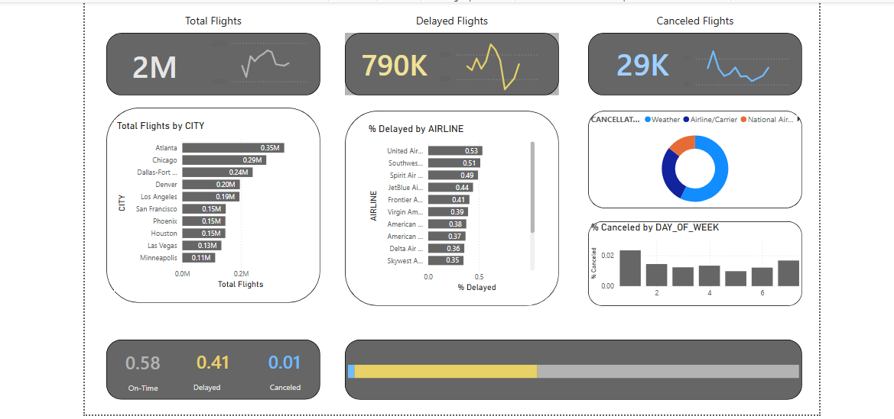

#  Flight Status Dashboard

An interactive Power BI dashboard analysing flight performance across U.S. airlines — covering delays, cancellations, on-time rates, and airline/airport comparisons.

---

##  Dashboard Preview



---

##  Key Metrics

| Metric | Value |
|--------|-------|
|  Total Flights | 2M |
|  Delayed Flights | 790K |
|  Cancelled Flights | 29K |
|  On-Time Rate | 58% |
|  Delay Rate | 41% |
|  Cancellation Rate | 1% |

---

##  Dashboard Features

- **KPI Cards** — At-a-glance totals for flights, delays, and cancellations with sparkline trends
- **Total Flights by City** — Horizontal bar chart ranking the busiest U.S. cities; Atlanta leads at 0.35M, followed by Chicago (0.29M) and Dallas-Fort Worth (0.24M)
- **% Delayed by Airline** — Comparison of delay rates across all major carriers; United Airlines has the highest delay rate (0.53) while SkyWest performs best (0.35)
- **Cancellation Causes** — Donut chart breaking down cancellations by cause: Weather, Airline/Carrier, and National Airspace (NAS)
- **% Cancelled by Day of Week** — Bar chart showing which days see the most cancellations
- **Overall Performance Bar** — Visual split of on-time vs. delayed vs. cancelled share across the full dataset

---

##  Project Structure

```
flight-status-dashboard/
│
├── Flight_Status_Dashboard.pbix   # Main Power BI report file
├── Flight_Status_Dashboard.png    # Dashboard preview image
├── data/                          # Source CSV files
│   ├── flights.csv
│   ├── airlines.csv
│   └── airports.csv
└── README.md
```

---

##  Tools & Technologies

| Tool | Purpose |
|------|---------|
| **Power BI Desktop** | Data modelling, DAX measures, and dashboard visualisation |
| **Power Query** | Data cleaning and transformation |
| **CSV files** | Raw source data |
| **DAX** | Custom KPI calculations and percentage metrics |

---

##  Data Source

The data used in this project was sourced from **[Maven Analytics](https://www.mavenanalytics.io/)** — a platform offering high-quality, real-world datasets for data analysis practice and portfolio projects.

>  Full credit to **Maven Analytics** for providing the dataset. Please refer to their website for data usage terms.

---

##  Key Insights

- Over **2 million flights** were analysed, with **41% experiencing delays** and only **1% cancelled**
- **Atlanta, Chicago, and Dallas-Fort Worth** are the busiest airports by total flight volume
- **United Airlines** has the highest delay rate at **53%**, while **SkyWest Airlines** has the lowest at **35%**
- **Weather and Airline/Carrier issues** are the dominant causes of flight cancellations
- Cancellation rates fluctuate by day of the week, with certain weekdays showing noticeably higher rates

---

##  Getting Started

### Prerequisites
- [Power BI Desktop](https://powerbi.microsoft.com/desktop/) (free) — latest version recommended

### Steps
1. Clone or download this repository
2. Place the CSV data files inside the `data/` folder
3. Open `Flight_Status_Dashboard.pbix` in Power BI Desktop
4. If prompted, update the data source path to point to your local `data/` folder
5. Click **Refresh** to load the data

---

##  Acknowledgements

- **[Maven Analytics](https://www.mavenanalytics.io/)** — for the flight status dataset used in this project
- **Microsoft Power BI** — for the visualisation platform

---

*Built as a data analytics portfolio project.*
